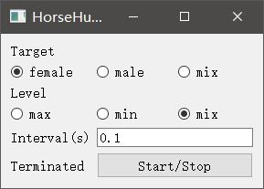

# Horse Hunter

现实生活我饱受欺凌，网上冲浪我重拳出击。

猎马人顶级装备，我手中敲击键盘的光，就是令堂火化的火星。

> 注：本软件仅限用于自卫反击，向网络暴力说不！

[](https://github.com/forewing/HorseHunter.py/actions)
[](https://discord.com/channels/685679145271033877/685682410930831369)

## 效果

剪贴板内每 0.1s 刷新一条金句，让你在骂战中不被欺凌

> 点击如下预览链接即意味着您已同意如下内容：
> 预览内容包含**暴力、血腥、人身攻击**内容，但**不针对包括您在内的任何个人、群体、组织**。
> 心理承受能力不足请**不要点击浏览**，若执意浏览，本项目组成员对造成的心理创伤**不负任何责任**。

[(预览链接)](imgs/preview.gif)

## 依赖

1. Python >= 3.6

2. [pyperclip](https://pypi.org/project/pyperclip/)

3. PyQt5 (GUI version only)

4. Flask (API version only)

```
pip install -r requirements-{VERSION}.txt
```

## GUI 版本

1. 前往 [Release](https://github.com/forewing/HorseHunter.py/releases) 下载最新程序 (HorseHunterGUI.exe)

2. 运行



> 更改设置后需要 Stop 再 Start 以应用更改


## 快捷使用

1. 运行脚本

```
python HorseHunter.py
```

2. 打开聊天框

Ctrl+V, Enter, Ctrl+V, Enter, Ctrl+V, Enter...

## 进阶使用

```
usage: HorseHunter.py [-h] [--target {female,male,mix}]
                      [--level {max,min,mix}] [--interval INTERVAL]

自动向剪贴板刷新金句，让你不再饱受欺凌

optional arguments:
  -h, --help            show this help message and exit
  --target {female,male,mix}, -t {female,male,mix}
                        设置辱骂对象, female=令堂, male=令尊, mix=混合. 默认 female
  --level {max,min,mix}, -l {max,min,mix}
                        设置辱骂等级, max=火力全开, min=口吐芬芳, mix=混合. 默认 max
  --interval INTERVAL, -i INTERVAL
                        设置刷新间隔(s). 默认 0.1
```

## 打包二进制文件

依赖 `pyinstaller`

1. GUI

```
pyinstaller -F --add-data "resources-max.txt;." --add-data "resources-min.txt;." --noconsole HorseHunterGUI.py
```

2. CLI

```
pyinstaller -F --add-data "resources-max.txt;." --add-data "resources-min.txt;." HorseHunter.py
```

将软件打包至 `dist/HorseHunter.exe`，使用方法与脚本形式相同。

## API

提供 Flask API 于 `HorseHunterAPI.py` 中。

可通过

```
$ FLASK_APP=HorseHunterAPI.py flask run
```

或

```
python HorseHunterAPI.py # Bind 127.0.0.1:6675
```

或其他途径运行，详细配置请参考 [Flask Documentation](http://flask.palletsprojects.com/en/1.1.x/)

| URL | 方法 | 参数 | 返回值 |
| :- | :- | :- | :- |
| `/api` | GET | `[level={max, min, mix}]`, `[target={female, male, mix}]` 若参数空缺或不合法，分别填补默认值 `level=max`, `target=female`| 参数所指定的金句范围内随机抽取一条字符串 |

## 致谢

金句资源(`resources-*.txt`)、性别替换(`replaceF2M.py`)内容来源：[直播点吧](https://nmsl.shadiao.app)